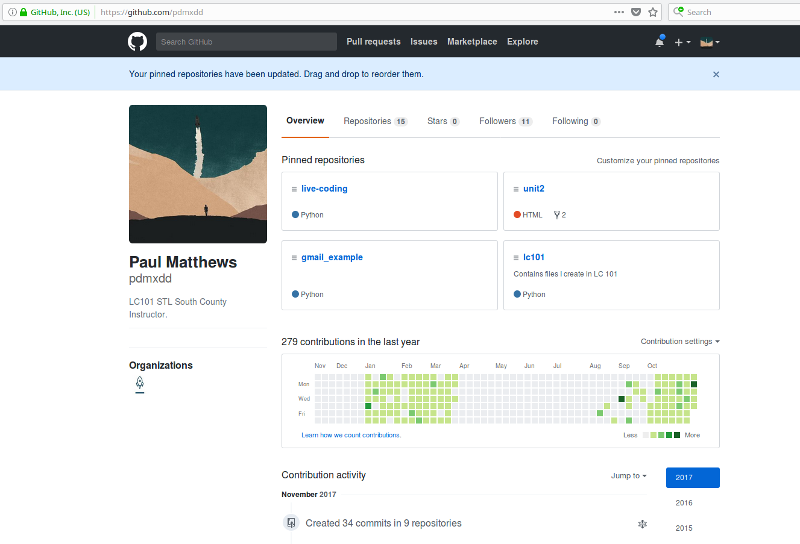

.. _online-profiles:

Online Profiles
===============

This career module focuses on the profiles companies will view
before and during the interview process. We will manipulate these
profiles in a way that will assist you during your job search. For
prep work, we will examine the following: a resume, a GitHub profile, and
a LinkedIn profile. We will go over what makes the profile good and
highlight where the profile can be improved. This will give us a list of
things to include, as well as things to leave out of each profile.

Technical Resumes
-----------------

A resume is a **crucial** part of your job search. We’re not going to
ramble on explaining what a resume is - it’s a part of the hiring
process for most industries. What we will focus on instead is how to
create a technical resume that will highlight the skills you bring to a
technical position.

Technical Resume Format
^^^^^^^^^^^^^^^^^^^^^^^

Let’s take a look at a resume we created at LaunchCode to show the
format of an ideal technical resume.

When it comes to the format of your resume, you need to quickly
summarize your skills, give evidence of those skills, outline your
learning journey so far, and then include everything else you would
typically include with a resume.

The clearly outlined sections of a technical resume:

#. Personal Information
#. Summary of Technical Skills
#. Technical Experience
#. Technical Education
#. Other Experience
#. Other Education

Personal Information
^^^^^^^^^^^^^^^^^^^^

You must include your first and last name, a phone number where you can
be reached, and a professional email address*.

.. note::

    A professional email address is some variation of your name.
    a.lovelace@gmail.com gives a much more professional feeling than
    fluffytoes32@yahoo.com. If you don’t have an email account for
    professional communication, you should create one. We personally
    recommend gmail.

You should also include a link to your GitHub profile, a link to your
LinkedIn, a physical address, and a link to your personal website (if
you have one).

Summary of Technical Skills
^^^^^^^^^^^^^^^^^^^^^^^^^^^

After clearly marking your personal information at the top of the page,
the next section should briefly outline your technical skills. You should
prioritize programming languages, frameworks, and major libraries over
operating systems and software. You should order your skills from most
familiar to least familiar. As a final note, you should also consider the
type of job you are looking for.

For example: I am looking for a Java back end development job.

::

   Technical Skills:

   Java, Spring, Hibernate, Thymeleaf, MySQL, Python, Flask, HTML, CSS, JavaScript, and jQuery.

This selection and order of skills shows my interviewer that I feel
strongest with Java, Spring, and MySQL, then I have less familiarity
with Python, and Flask (another back end skill set), and finally that I 
have done a little with front end and am comfortable using those tools
– but would need a ramp up to do them exclusively.

.. tip:: 

   You should not include every language or technology you’ve heard of. You
   should only include skills you would feel comfortable using to build a
   project today. You’ve learned the skill and have some practical
   experience with the skill. This will usually mean an entry level
   developer will include fewer than 10 skills on their resume.

Technical Experience
^^^^^^^^^^^^^^^^^^^^

After listing the skills you have, you need to back up your skills with
some experience you have gained with those skills. You can do this by
mentioning **projects** you have completed, or by outlining
**professional experience** that required the use of those skills. Most
of you do not have professional experience yet, but you have completed
projects. You will want to include projects that used the skills you
mentioned in your technical skills section.

::

   Project Experience:
   Household Budgeting Web-app -- www.familybudget.com
   A web-app that allows users to add members to their household and track incomes and expenses by categories.
       - Java, Spring, Hibernate, Thymeleaf, MySQL, HTML, CSS, and jQuery
       - Aside from the budget tracking features, it utilizes Spring Security to allow for secure authentication to the web server
       - github.com/mygithubaccount/family-budget

   Blogz
   A school project completed in LC101, it allows users to signup, create, and read blog posts.
       - Python, Flask, SQLAlchemy, Jinja, MySQL, and HTML
       - Beyond the assigned tasks, I included a feature that allows users to write, edit, or delete their own blog posts
       - github.com/mygithubaccount/blogz

   Personal Portfolio -- myportfolio.com
   A portfolio I am currently building. It will eventually contain links to my other projects, 
   and document what I am currently learning.
       - React, JavaScript, HTML, CSS, and Bootstrap
       - I am currently learning React to incorporate into this project
       - github.com/mygithubaccount/portfolio

You need to include: - The project name - A brief description of the
project - Skills/Technologies used in the project - A key feature of your project -
github repo link

You should include a live link to your project, if it is online.

Technical Education
^^^^^^^^^^^^^^^^^^^

You need to show how you learned your technical skills. You can do this
by including college courses you have taken, programs you have been a
part of, books you have worked through, and MOOC’s you have completed.

.. tip:: 

   MOOC stands for Massive Open Online Course. This is the majority of your
   online programs like Udacity, Udemy, EdX, KhanAcademy, etc.

::

   Technical Education:
   LC101
       - 20 week program that focuses on programming fundamentals, web basics, and more advanced concepts with Java.
       - Curriculum covered: Python, Flask, Jinja2, SQLAlchemy, MySQL, Java, Spring, Hibernate, and Thymeleaf
       - Built multiple in class projects

   TeamTreeHouse.com
       - Worked through the Java and Spring curriculum of TeamTreeHouse.com
       - Skills: Java, Eclipse, Spring, Spring Security, Hibernate, and JDBC.
       - Videos to cover concepts and projects to practice concepts

   CS Courses from UMSL
       - Completed 4 CS courses from UMSL
       - Intro to Java Programming, Java Programming II, Intro to Databases, and Operating Systems I

Other Experience
^^^^^^^^^^^^^^^^

After covering your technical experiences, you still need to include your
non-technical work experience.

::

   Work Experience:
   Assistant Manager, Upper Limits
       - Day to day operations of a rock climbing gym, tending register, performing safety inspections, assisting customers, cleaning
       - Worked with managers to plan and run special events including birthday parties, corporate team building, and climbing competitions
       - Taught Rock Gym 101 - teaching novice climbers about top rope climbing, both how to and necessary safety precautions

   Manager/Technical Support, Cellular Communication
       - Provide technical support & information about mobile devices
       - Troubleshoot hardware / software problems for customers and in house computers

This section can be quite long, depending on the jobs you have had so
far. You should try to include as much of it as possible, but focusing
primarily on your experiences with problem solving, learning new things
on the job, and working with others.

Other Education
^^^^^^^^^^^^^^^

If you have any other formal education you didn’t include in the
technical education section, you still need to include it as it provides
invaluable information about you.

::

   Education:
   Webster University, St. Louis, MO
   Bachelor of Arts, History with a German minor

Final Notes
^^^^^^^^^^^

Your resume should not be longer than two pages! If it is longer than
two pages, try to eliminate sections from your non-technical education
or non-technical work experience. If you are still short for room, try
reducing the number of bullet points for each item of your resume.
Again, you want to focus on showing them your problem solving skills.

Some people like to have a master resume that contains all of the
experience, education, skills, and projects they have ever worked on.
This a great thing to have for yourself, but when you are sending a
professional resume, you don’t want it to be longer than two pages. If
you can, try to get your resume to one page.

GitHub Profiles
---------------

Your GitHub profile can be an immensely powerful tool in showing other
people projects you have completed, how often you work on projects, how
long you’ve been a programmer, and the different languages and
technologies you have worked with. Also, the more you use GitHub, the
more comfortable you will be with using any form of version control.

After signing into your GitHub profile, you can click on the picture.
This will take you to your account settings and will allow you to update
your profile settings. You can upload a picture, change your bio,
display an email address, and more!

GitHub Username
^^^^^^^^^^^^^^^

Your GitHub username should be professional, much like your professional
email it should be some variation of your name. You should avoid twitter
handles, gamertags, or anything that is not a variation of your name.

``a.lovelace`` is a great GitHub profile name for Ada Lovelace!

countessofcomputers is a poor GitHub profile name for Ada Lovelace –
although she has a steeped background with computers, she should still
choose a professional github profile name.

You should also include your professional email address with this GitHub
profile.

GitHub Profile Picture
^^^^^^^^^^^^^^^^^^^^^^

First impressions are very important. You should include a nice looking
shot of your face for your GitHub profile.

This would be a great GitHub profile picture for Alan Turing:

   Alan Turing Profile Picture

Take note that *your GitHub profile is public facing!* If you do not
wish to upload a picture of yourself to GitHub, you can still pass the
assignment. Notify your mentor if you are not comfortable uploading a
picture of yourself to your GitHub profile.

GitHub Profile Bio
^^^^^^^^^^^^^^^^^^

You should include a bio for your GitHub profile. It should quickly
state who you are and what you are looking for.

A great GitHub bio might look like this:

::

   Bio:
   I recently completed LC101 and am currently learning more about Java, Spring, and Hibernate. I am actively looking for development positions.

Pinned Repositories
^^^^^^^^^^^^^^^^^^^

An awesome feature of GitHub is that it allows you to pin repositories!
If you have linked a repo to your resume or simply want to highlight a
repository, you can mark the repository as a pinned repository and it
will be highlighted to anyone that visits your GitHub profile.

Below you will find an image of my personal GitHub account that has 4
pinned repositories. A repository of the live-coding problems we worked
on in our last class, a repo for LC101 examples I created while teaching
that class, a repo for Unit 2 of LC101 which contains all the
presentations I gave throughout the class, and finally a repo called
gmail_example which is a small Flask project I created to show how to
connect to Gmail’s API and to send emails from a web app!

   GitHub Pinned Repositories

Anyone that comes to my main profile page will find these 4 repositories
before anything else!

.. tip:: 

   You can set your pinned repositories by clicking the *Customize your
   pinned repositories* text you see in the top right corner of the image.

Project README
^^^^^^^^^^^^^^

The final aspect that makes for a great GitHub profile is a specific
project README file.

A README file is a markdown file that is displayed at the bottom of the
repository. This is where you can include the requirements of your
project and a brief description of what your project does. If someone 
wants to clone and run your project, this is where they will learn what 
is needed to do so. As you are searching for jobs, you should have a project 
README file for every project you want to share with a potential employer.

The README gives me an ability to explain to the interviewer what my
project does, what skills I used in my project, and what I am going to
do with this project in the future.

You can add in a requirements section that shows what dependencies and
environment they will need to use to run the project.

You can also include images in your Markdown file that may include
screenshots of wireframes, actual views, or model diagrams of your
project. That way, you can show off what you are planning for the 
future of the project.

GitHub is public
^^^^^^^^^^^^^^^^

As a final reminder, your GitHub profile is public. Anyone can search for
it and view any of the information on your profile. If you have any
issues with uploading personal information to your GitHub profile, please
talk with your mentor about acceptable usernames, pictures, and bios.
You will still be required to use GitHub, but we do not want you sharing
any information you are not comfortable with sharing.

LinkedIn Profiles
-----------------

You can think of your LinkedIn profile as your digital resume. It should
contain your professional experience, skills, and education.

Your GitHub profile is a great demonstration of your technical skills,
but it is only very beneficial to a technical individual. Your LinkedIn
profile should be geared towards the HR department, giving you a chance
to further explain things about yourself.

Much like your GitHub profile, you want to associate a professional
email address with your LinkedIn account and have a nice looking
headshot to include as a picture.

Contact Information
^^^^^^^^^^^^^^^^^^^

Your contact information should include your professional email address
and your phone number.

Summary
^^^^^^^

LinkedIn gives you the ability to write a summary. Most interviewers
read this to get a high level understanding of what you are looking to
do. So put some passion into writing your summary!

Core Skills
^^^^^^^^^^^

LinkedIn has a section dedicated to skills. This is the area where you
may like to include some of the technical skills you have recently learned,
as well as other soft skills you have accumulated from non-tech education
or experience.

History
^^^^^^^

A great advantage of LinkedIn over a resume is that you can greatly
expand upon your work history and education. You can also use the social
networking aspect of LinkedIn to connect with past coworkers and
classmates that can verify the skills you include in your profile.

For some good tips, read `10 Examples of Highly Impactful LinkedIn Profiles <https://komarketing.com/blog/10-examples-highly-impactful-linkedin-profiles/>`_
