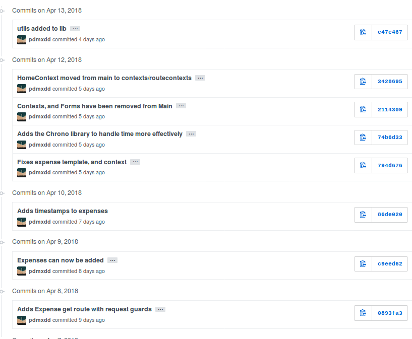

Expense Tracker
===============

Quick Links
-----------

- `Assignment Repository for Expense Tracker <https://github.com/LaunchCodeEducation/liftoff-assignments-paul>`__
- `Expense Tracker GitHub Repository <https://github.com/LaunchCodeEducation/expense_tracker>`__
- Jump to week: :ref:`1 <et-week-1>` \| :ref:`2 <et-week-2>` \| :ref:`3 <et-week-3>` \| :ref:`4 <et-week-4>` \| :ref:`5 <et-week-5>` \| :ref:`6 <et-week-6>` \| :ref:`7 <et-week-7>` \| :ref:`8 <et-week-8>`

Overview
--------

For his Liftoff project, Paul has decided to create a web application
that will help him track his expenses. This page will outline the steps
that he follows in developing his project, completing each of the
Liftoff assignments along with completing user stories and participating
in the weekly agile ceremonies like stand-ups and project kickoffs.

.. _et-week-1:

Week 1
------

Sprint 1 Kickoff
^^^^^^^^^^^^^^^^

Most sprint kickoffs will consist of planning estimating, and committing
to user stories to complete during the sprint. Since there are not user
stories created yet (we’ll do that in week 2) this kickoff is a litle
different.

We discussed our project ideas–Chris’ for an event log and Paul’s for an
expense tracker–and got some feedback on how big each project might be
to be doable. We also discussed the particular technologies that we’ll
be using to build our projects.

Finally, we discussed the things that we expect to have to learn along
the way, beyond what we already know. Paul will be using a new-to-him
framework called Rocket (for the Rust programming language), while Chris
has some unknowns around how user authentication will work. He also
wants to use `test-driven
development <https://en.wikipedia.org/wiki/Test-driven_development>`__
which he hasn’t done in Spring and will have to learn about.

Assignment: Project Outline
^^^^^^^^^^^^^^^^^^^^^^^^^^^

The `project
outline <https://github.com/LaunchCodeEducation/liftoff-assignments-paul/tree/master/P2-Project_Outline>`__
for Expense Tracker gives an overview of the desired functionality.

.. _et-week-2:

Week 2
------

Sprint 1 Standup
^^^^^^^^^^^^^^^^

During our sprint 1 standup, we discussed our completed project outlines
and upcoming work. Here are Paul’s items:

**What was accomplished:** The Expense Tracker project outline was
completed and the preliminary features have been set. Concerns about
Rocket’s nonexistent user authentication were discussed and ultimately
it was determined that Paul will build his own user authentication.

**What is planned next:** User stories will be written and prioritized. 
Wireframes will be created.

**Blockers:** No blockers have been identified yet. However, user
authentication will be hand created and Diesel, an ORM for Rust and
Postgres, will need to be researched.

Assignment: Project Planning
^^^^^^^^^^^^^^^^^^^^^^^^^^^^

Paul's `Project
Planning submission <https://github.com/LaunchCodeEducation/liftoff-assignments-paul/blob/master/P3-Project_Planning/>`__
includes 4 wireframes for the Expense Tracking application. A link to
the Pivotal Tracker project that contains user stories for the current
sprint and upcoming stories in the icebox.

Here is a screenshot of the tracker with initial user stories.

.. figure:: figures/sprint_1_stories.png
   :alt: Sprint 1 Stories

   Sprint 1 Stories

.. _et-week-3:

Week 3
------

Sprint 1 Review and Retrospective
^^^^^^^^^^^^^^^^^^^^^^^^^^^^^^^^^

For the review/retro Chris and Paul discussed the work completed
during the first sprint. Both completed initial project planning and setup.
Working through some details such as wireframes and user stories helped
clarify the initial work to be done, which will begin in earnest this
week as the second sprint kicks off.

During the retrospective portion of the discussion, they discussed how in
some ways, it didn’t feel like much had gotten done since there wasn’t
much, if any, code written. Paul made the point that while little code
was written, the planning that was done should help the initial coding
phase of the project go more quickly than it otherwise would have. He noted
that if a programmer just jumps into a project without designing and
planning the work to be done, a lot of time can be wasted in doing
things inefficiently, reworking portions of the app, and generally
figuring out how it should be structured. Doing this work up front
should make things go more smoothly from now on!

Assignment: Project Setup
^^^^^^^^^^^^^^^^^^^^^^^^^

`Submission in
liftoff-assignments <https://github.com/LaunchCodeEducation/liftoff-assignments-paul/tree/master/P4-Project_Setup>`__

The project’s `GitHub
repository <https://github.com/LaunchCodeEducation/expense_tracker>`__ was set up.
Initial commits created a basic “Hello, world!” Rocket application via the
`Rocket Quickstart <https://rocket.rs/guide/quickstart/>`__.

.. figure:: figures/expense-tracker-initial-commit.png
   :alt: Initial commits

   Initial commits

Sprint 2 Kickoff
^^^^^^^^^^^^^^^^

For the second sprint, Paul plans on working through the initial user
stories. These are focused on basic user management (registration,
login, logout). He couldn’t find any good external crates in Rust to
help with user authentication. He will need to create user
authentication on his own, and plans to use the same concepts we learned
in Unit 2 – `Password Hashing &
Salting <https://education.launchcode.org/web-fundamentals/class-prep/13/>`__.

   Sprint 2 user stories

Here's an overview: 

- As a prospective user, I can create an account. 
- As a user, I can login to my account. 
- As a user, I can logout.

In order to complete these stories, he will have to create a ``User``
model, and setup the project’s database. He will have to start learning
about Diesel (an ORM for Rust and Postgres) in order to close down this
batch of user stories.

If he completes these three stories, there are more stories planned for
future sprints and stories in the backlog.

.. _et-week-4:

Week 4
------

This week, the focus was on completing user stories and gaining momentum.

Sprint 2 Standup
^^^^^^^^^^^^^^^^

**What was accomplished:** User registration, login, and logout
stories were all complete. (See associated commits and screenshots
below.) Paul wanted to make more progress than he did, but ended up
sinking a lot of time into the aspects of his project he didn’t
understand well. He had to build smaller tutorial projects to understand
the ORM, and how templating works in his tech stack. Now that he has
them working correctly, he should be able to make quicker progress in
completing user stories.

   Sprint 2 Commits

`View the
codebase <https://github.com/LaunchCodeEducation/expense_tracker/tree/535465868eded761b93fd8ff0d805c5505d02861>`__
for ``expense-tracker`` as of the end of sprint 2.

**Screenshots:** 

- `Expense Tracker Registration <https://raw.githubusercontent.com/LaunchCodeEducation/liftoff/master/src/modules/demo-projects/expense-tracker/figures/expense-tracker-register.png>`__ 
- `Expense Tracker Login <https://raw.githubusercontent.com/LaunchCodeEducation/liftoff/master/src/modules/demo-projects/expense-tracker/figures/expense-tracker-login.png>`__

**What is planned next:** Next, Paul will work on a landing page after a
user logs in, flash messaging, and the category model. He has created
and estimated new stories for the remainder of this sprint and moved
them into the **Current Iteration** column (see Pivotal Tracker screenshot
below).

.. figure:: figures/sprint_2_stories_2.png
   :alt: More Sprint 2 Stories

   More Sprint 2 Stories

**Blockers:** Currently, Paul is blocked by flash messaging. He
understands the concept, but has never implemented flash messaging in a
Rust/Rocket project. He will have to learn more about flash messaging in
Rocket by referring to the `Rocket Documentation for a Flash
Response <https://api.rocket.rs/rocket/response/struct.Flash.html>`__.
He has a lot of reading and trial projects to complete before he can
successfully implement flash messaging in his project, which is his next
user story.

.. _et-week-5:

Week 5
------

Project Review
^^^^^^^^^^^^^^

This week's project assignment is a Project Review. Following is a
summarized version of what Chris and Paul discussed during Paul’s
project review.

What stories have you been working on recently?
^^^^^^^^^^^^^^^^^^^^^^^^^^^^^^^^^^^^^^^^^^^^^^^

I have completed User Registration, User Login, User Logout, Flash
Messaging, and Tera Templates with Foundation CSS.

What code design decisions have you made so far and why?
^^^^^^^^^^^^^^^^^^^^^^^^^^^^^^^^^^^^^^^^^^^^^^^^^^^^^^^^

I am very comfortable with MVC and have been designing my project to
follow this pattern. I have created 3 models: User, Category, and
Expense. My ORM Diesel, requires that I also write a Schema for my
database which has been completed. To use Diesel, I built a
``database_manager.rs`` file that manages the database connection and acts
as the controller for this project. To be completely honest, I don’t
have a great understanding on how to separate my Rust files and to call
one file from another file. If you look into my ``database_manager.rs`` file,
it actually contains the Models, the Schema Diesel requires, and the
Controller logic. Ideally, I would like to break this into three
separate files: a database connection manager, the models, and the
controller.

What has been the most challenging aspect of your project and why?
^^^^^^^^^^^^^^^^^^^^^^^^^^^^^^^^^^^^^^^^^^^^^^^^^^^^^^^^^^^^^^^^^^

The number of technologies I was unfamiliar with in starting this
project. I have been using Rust for a while, but have never worked with
Rocket, Diesel, or Tera Templates. Tera’s documentation isn’t very good,
but it is very similar to Jinja2 which I have lots of familiarity with.
Rocket has great documentation, but handles things a little differently
than other web back-ends I have worked with. Diesel has great
documentation, and multiple guides. Rust and Rocket are not used by a
huge number of people. So when I run into a problem, I can’t find any
good Stack Overflow posts that help me through the issue. I am trying
to read the documentation myself, which is ultimately a great thing, but
drastically increases the time it takes me to write code.

What are you working on next?
^^^^^^^^^^^^^^^^^^^^^^^^^^^^^

The next feature I need to build is the Category feature, because
expenses won’t work without categories. However, my codebase is
currently difficult to work with because I don’t know how to separate my
files and call them from each other correctly in Rust. So my next step
is to refactor my codebase. I won’t be changing any logic, or code, with
the exception of the import statements. I will simply break apart my
large and cumbersome ``database_manager.rs`` file into ``model``, ``controller``,
``schema``, and ``database_manager`` files. This way, working with my code will
become much easier. I need to do this before the category feature or expenses, or
else the amount of refactoring I will have to do will be massive.

Project Reviewer Feedback:
^^^^^^^^^^^^^^^^^^^^^^^^^^

Chris agrees with Paul. He needs to fix his MVC issues before working on
additional features.

Sprint 2 Review and Retrospective
^^^^^^^^^^^^^^^^^^^^^^^^^^^^^^^^^

For the sprint review/retro Chris and Paul discussed the work completed
during the second sprint. Paul completed user registration, user login,
user logout, dynamic menu, tera templating, and flash messaging.

During the retrospective portion of the discussion, Paul remarked that
he can’t believe how fast these sprints are going. There are only four
sprints in the duration of this course, and we have already completed
half of them! Paul feels like he is behind on his project, but knows if
he can clean up his project so that it’s in an MVC pattern, he should be
able to make quick progress. He still needs to implement the categories and
expenses features before his project is done. Having already gone through the
steps for users, both of his remaining sections should be much easier.
He should be able to build off of what he has already
accomplished. He is running low on user stories and may have to write
more. He may also possibly need to draw more wireframes before he can
continue with the next sprint.

Sprint 2 Commit Log
^^^^^^^^^^^^^^^^^^^

   Sprint 2 final commits

`View the
codebase <https://github.com/LaunchCodeEducation/expense_tracker/tree/bdcb3301235ce092a72818bdafc891dfdf628bee>`__

Sprint 3 Kickoff
^^^^^^^^^^^^^^^^

For the third sprint, Paul plans on working on categories, and hopefully
expenses. For users he has built ``create_user``, and ``get_user`` functions
that work with Diesel. However, he has not yet worked with *Update*, or
*Delete* in Diesel, and he will need to work with both of them to
successfully build out categories and expenses. He will be referring to
the `Diesel Documentation <http://docs.diesel.rs/diesel/index.html>`__
to learn how to update and delete with this ORM.

   Sprint 3 user stories

.. tip:: 

   You will notice Paul added a chore to the top of his current iteration.
   While refactoring is a task that he needs to complete this week, it
   doesn’t change anything from the user’s perspective. Thus, calling it a
   story would be incorrect. Since it’s not a user story, he isn’t
   estimating it. Completing this chore will make his future user stories
   easier to accomplish! Paul thinks it will take him around 2 hours to
   complete this task.

.. _et-week-6:

Week 6
------

There is no project module assignment for Week 6, Paul focused on
completing user stories.

Sprint 3 Standup
^^^^^^^^^^^^^^^^

**What was accomplised:** Refactor project to follow MVC. Implemented
Request Guards to authorize users for all given paths. User can create,
and view categories. User can create and view Expenses.

   Sprint 3 Commits

`View the
codebase <https://github.com/LaunchCodeEducation/expense_tracker/tree/c9eed625271a6e152710b379ce74a11cbcb710fb>`__
for ``expense-tracker`` as of the middle of sprint 3.

**Screenshots:** 

- `Expense Tracker Create Category <https://raw.githubusercontent.com/LaunchCodeEducation/liftoff/master/src/modules/demo-projects/expense-tracker/figures/expense-tracker-create-category-1.png>`__ 
- `Expense Tracker View Categories <https://raw.githubusercontent.com/LaunchCodeEducation/liftoff/master/src/modules/demo-projects/expense-tracker/figures/expense-tracker-view-categories.png>`__
- `Expense Tracker Create Expense <https://raw.githubusercontent.com/LaunchCodeEducation/liftoff/master/src/modules/demo-projects/expense-tracker/figures/expense-tracker-create-expense.png>`__ 
- `Expense Tracker View Expenses <https://raw.githubusercontent.com/LaunchCodeEducation/liftoff/master/src/modules/demo-projects/expense-tracker/figures/expense-tracker-view-expenses.png>`__

**What is planned next:** Next, Paul will continue working on Expenses.
He is currently using a timestamp in his database, but is having trouble
reading the timestamp back in Rust. After he has finished that he will
need to build in the edit, and delete functions for both expenses, and
categories.

   More Sprint 3 Stories

**Blockers:** Currently Paul is blocked by Rust’s time library. He can
create timestamps, but the time function cannot be converted to a
String, so he has no way of displaying the timestamp to the user. He
will have to research alternative 3rd party time libraries, or build his
own function that will be able to create a timestamp string, from a
timestamp object.

.. _et-week-7:

Week 7
------

Sprint 3 Review and Retrospective
^^^^^^^^^^^^^^^^^^^^^^^^^^^^^^^^^

For the sprint review/retro Chris and Paul discussed the work they
copmleted during the third sprint. Paul completed creating & viewing
categories, creating & viewing expenses, refactored his project into an
MVC format, and refactored his main method into lib/utils that contain
his contexts, form, and utility functions.

During the retrospective portion of the disucssion, Paul mentioned he
had technical difficulties, and was unable to complete some of his user
stories. The power adapter for his laptop was misplaced, and he had to
wait four days to get a replacement. In that time, he didn’t make any
progress on his project, but was able to plan his project presentation
so it wasn’t completely wasted time. Outside of his techncial issues, he
struggled with dates in Rust. Rust’s standard time library had no option
for printing out a human readable statement, which makes displaying it
to a user problematic. He was able to overcome this issue by finding and
implementing the Chrono crate in Rust. Chrono uses the underlying time
library from the standard library, but adds additional functionality for
readability purposes. He can now display dates, and times to his users.
He was unable to complete editing, and deletion of categories, and
expenses, so he plans on completing that in his final sprint.

Sprint 3 Commit Log
^^^^^^^^^^^^^^^^^^^

   Sprint 3 final commits

`View the
codebase <https://github.com/LaunchCodeEducation/expense_tracker/tree/c47e467935f58fd0cb62073f9504591d813a60eb>`__

Sprint 4 Kickoff
^^^^^^^^^^^^^^^^

For the fourth, and final sprint of Liftoff, Paul plans on building in
the the edit, and delete functionality for categories, and expenses. If
he completes that he wants to build a password, and email reset feature
to assist with user management, and finally after completing that he
wants to build a reporting feature into the Expense-Tracker, so a user
can view their stored information in a more benefical way.

.. figure:: figures/sprint_4_stories.png
   :alt: Sprint four user stories

   Sprint four user stories

It may appear that Paul has bitten off more than he can chew in this
sprint. That’s ok, writing additional user stories only gives Paul more
clarity into what to work on after Liftoff ends. He can continue using
Agile on his own to stay on track with his project.

Assignment: Project Presentation
^^^^^^^^^^^^^^^^^^^^^^^^^^^^^^^^

Although Paul’s project isn’t completely done yet he still needs to
complete his Project Presentation assignment.

Expense Tracker Presentation :download:`PDF <Expense_Tracker_Presentation.pdf>`

Paul found that in working on this assignment he completed much more
than he was giving himself credit for! He has mutliple screens to show,
everything is writing to the database correctly, and his project is
organized in a format that makes it easy to talk about his code. He has
learned a tremendous amount about programming, web development, Rust,
Rocket, Diesel, and Postgres while building this project. He’s not an
expert in Rust, or Rocket at this point in time, but feels comfortable
solving issues as they arise as he continues to work on projects in this
tech stack.

.. _et-week-8:

Week 8
------

Sprint 4 Standup
^^^^^^^^^^^^^^^^

**What was accomplished:** Users can edit, and delete expenses. Users
can edit, archive, and unarchive categories. Users can change their
email address. Users can change their passwords. Users can view a report
of all of their expenses.

   Sprint 4 commits

`View the
codebase <https://github.com/LaunchCodeEducation/expense_tracker/tree/3f9cc99656c3ad2a55fd3f3684e32e11b61cc436>`__

**Screenshots:** 

- `Expense Tracker Edit Expense 1 <https://raw.githubusercontent.com/LaunchCodeEducation/liftoff/master/src/modules/demo-projects/expense-tracker/figures/expense-tracker-edit-expense1.png>`__ 
- `Expense Tracker Edit Expense 2 <https://raw.githubusercontent.com/LaunchCodeEducation/liftoff/master/src/modules/demo-projects/expense-tracker/figures/expense-tracker-edit-expense-2.png>`__ 
- `Expense Tracker Delete Expense 1 <https://raw.githubusercontent.com/LaunchCodeEducation/liftoff/master/src/modules/demo-projects/expense-tracker/figures/expense-tracker-delete-expense-1.png>`__ 
- `Expense Tracker Delete Expense 2 <https://raw.githubusercontent.com/LaunchCodeEducation/liftoff/master/src/modules/demo-projects/expense-tracker/figures/expense-tracker-delete-expense-2.png>`__ 
- `Expense Tracker Archive Category <https://raw.githubusercontent.com/LaunchCodeEducation/liftoff/master/src/modules/demo-projects/expense-tracker/figures/expense-tracker-archive-category.png>`__ 
- `Expense Tracker Unarchive Category <https://raw.githubusercontent.com/LaunchCodeEducation/liftoff/master/src/modules/demo-projects/expense-tracker/figures/expense-tracker-unarchive-category.png>`__ 
- `Expense Tracker Change Email 1 <https://raw.githubusercontent.com/LaunchCodeEducation/liftoff/master/src/modules/demo-projects/expense-tracker/figures/expense-tracker-change-email-1.png>`__ 
- `Expense Tracker Change Email 2 <https://raw.githubusercontent.com/LaunchCodeEducation/liftoff/master/src/modules/demo-projects/expense-tracker/figures/expense-tracker-change-email-2.png>`__ 
- `Expense Tracker Change Password 1 <https://raw.githubusercontent.com/LaunchCodeEducation/liftoff/master/src/modules/demo-projects/expense-tracker/figures/expense-tracker-change-password-1.png>`__ 
- `Expense Tracker Change Password 2 <https://raw.githubusercontent.com/LaunchCodeEducation/liftoff/master/src/modules/demo-projects/expense-tracker/figures/expense-tracker-change-password-2.png>`__

**What is planned next:** 

This is the last class of Liftoff, and Paul
has made significant progress on his project. He now has a web app built
with Rust/Rocket, Tera, Diesel, and Postgres that allows users to: 

- Create Accounts 
- Manage Accounts 
- Create Categories 
- Edit Categories
- Archive & Unarchive Categories 
- Create Expenses 
- Edit Expenses 
- Delete Expenses 
- Generate Basic Reports

He is proud of what he has accomplished so far, however being a
programmer, and working in technology means always learning. Paul is at
an endpasse, he can continue working on this project – Expense Tracker
by outling bugs, chores, or new features defined by user stories. Or,
Paul can start working on a new project.

At this point in time he has a large enough project to talk about in
interviews. He can talk about **what he learned** (Rust, Rocket, Diesel,
Request Guards etc), what **challenges he overcame** (Rust’s standard
time library doesn’t support string representations of time, Rust
doesn’t have anything in the standard library for encrpyting and
decrypting passwords, etc), what **mistakes he made** (not using R2D2 to
manage DB calls, not using MVC from the beginning, etc).

Continuing with this project Paul would: 

- Deploy his project 
- Build out more reports 
- Allow multiple categories be tagged to an expense 
- Email funcitonality – reports can be emailed, users can reset password via email 
- Redesigning the front end

**Blockers:** Paul’s project is currently complete he has a working
version that contains all the features he orginally wanted to include.
His next step would be to deploy his project, he looked into multiple
services to host and deploy his project, however he is currently blocked
by Rocket. In order for Rocket to run it uses a nightly build of Rust!
You could deploy a nightly build of rust to a server, however it would
take Paul a large amount of time to figure everything out. So he is
putting deploying his project on hold.
